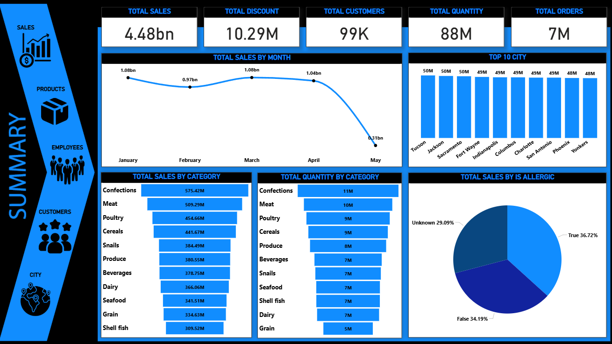
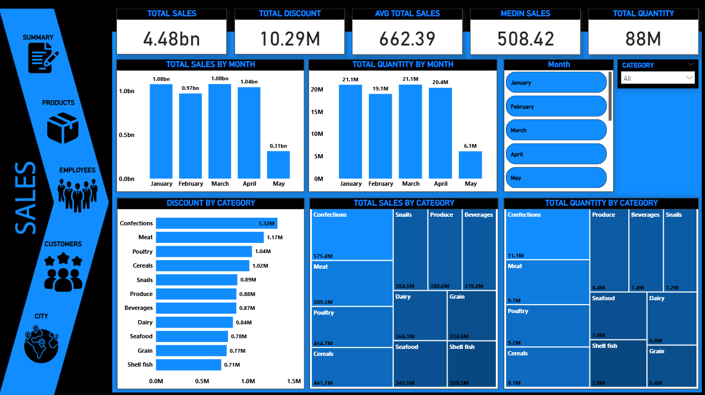
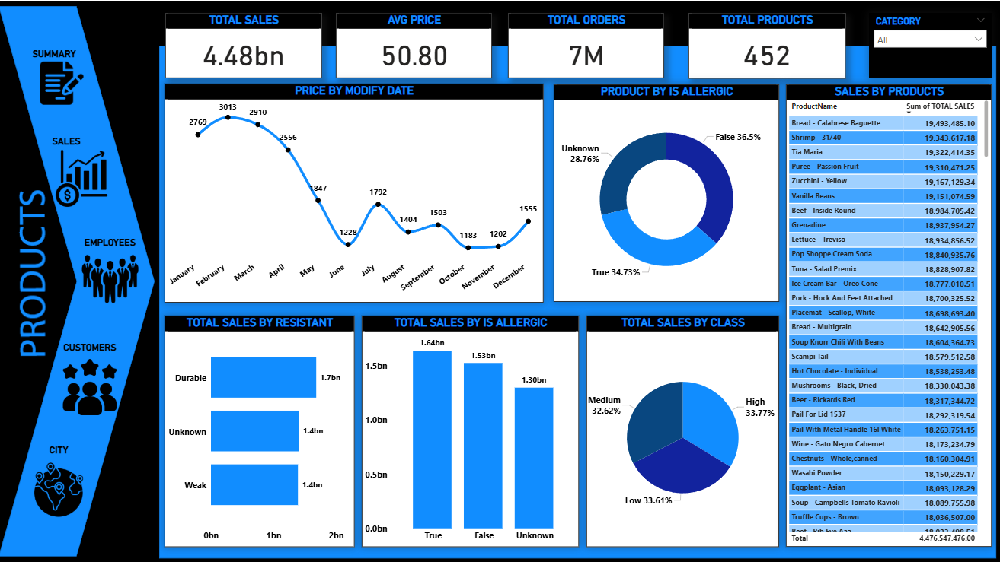
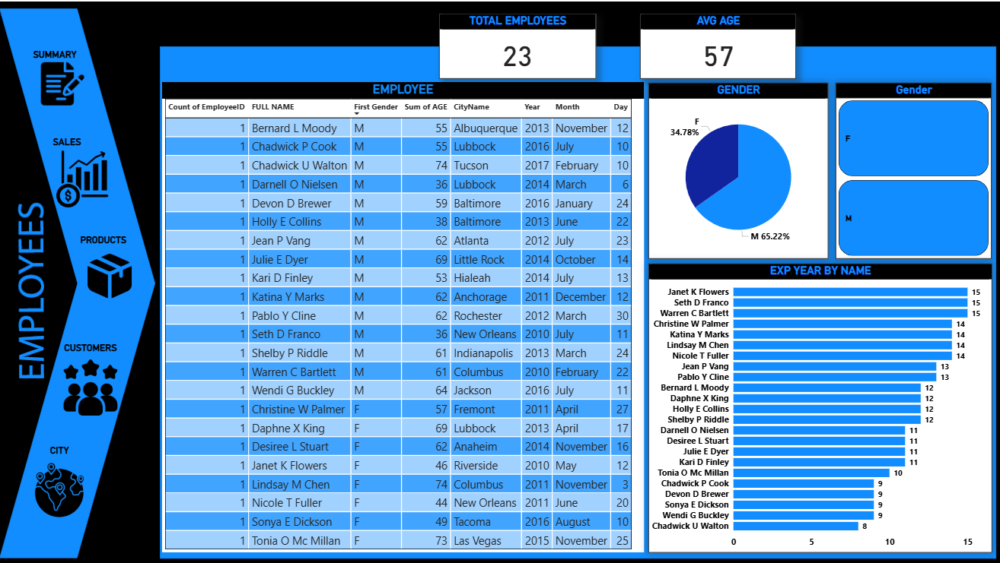
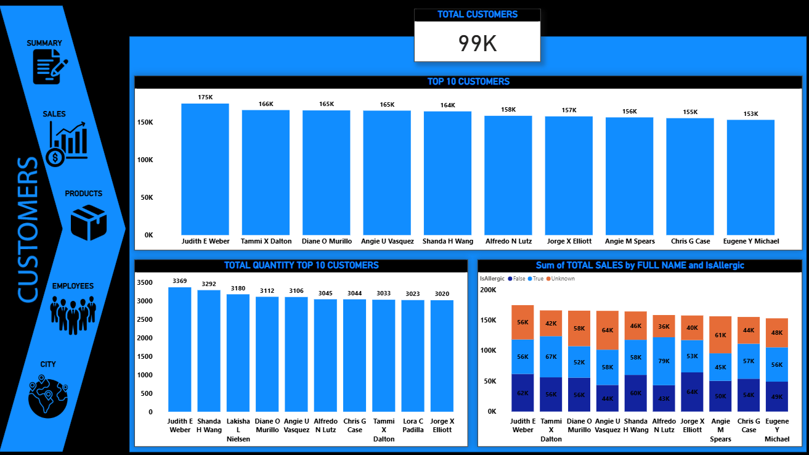

📊 Full Data Analysis Project 

📌 Project Overview
This project is a comprehensive end-to-end data analysis solution built using Power BI.
It analyzes multiple business areas including sales, products, customers, employees,
and cities to support strategic and operational decision-making.

---

🎯 Project Objectives
- Analyze total sales, discounts, orders, and quantities
- Understand product performance across categories and classes
- Identify top-performing customers and cities
- Analyze customer behavior and purchasing patterns
- Evaluate employee distribution and experience
- Provide a complete business performance overview

---

🗂 Data Description
The dataset includes:
- Sales transactions
- Product details and categories
- Customer information
- Employee records
- City and location data

Data preparation, cleaning, and modeling were handled using **Power Query**.

---

🛠 Tools & Technologies
- Power BI
- Power Query
- DAX
- Excel

---

📊 Dashboard Pages

🔹 Summary
High-level KPIs including total sales, discounts, customers, quantities, and orders,
along with monthly and category-level performance.

---

🔹 Sales Analysis
Detailed analysis of sales trends, discounts, quantities, and category performance.

---

🔹 Products Analysis
Product-level analysis including pricing trends, allergenic classification,
product classes, and top-selling products.

---

🔹 Employees Analysis
Employee demographics, experience, gender distribution,
and performance-related insights.

---

🔹 Customers Analysis
Top customers by sales and quantity,
customer behavior analysis, and segmentation.

---

📈 Key Insights
- Total sales reached **4.48B** with **7M** total orders
- Confections and Meat are among the top revenue-generating categories
- Sales show strong performance during early months with a noticeable decline in May
- A small group of customers contributes a significant share of total sales
- Product class and allergenic attributes have a clear impact on sales distribution

---

📁 Project Files
- Power BI dashboard file (.pbix)
- Dataset files
- Dashboard screenshots

---

🚀 Portfolio Value
This project demonstrates:
- Full data analysis lifecycle
- Advanced Power BI reporting
- KPI design and storytelling
- Multi-dimensional business analysis
- Strong data modeling and DAX skills

📌 This project is part of my **Data Analyst Portfolio**.
